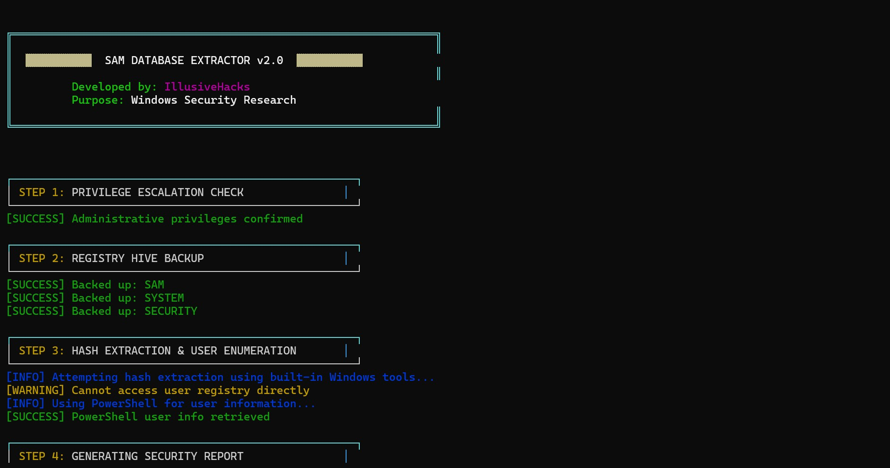

# SAM-Toolkit-Security-Account-Manager-Extractor  - Illusivehacks security suite
SAM Database Extraction &amp; Password Cracking Toolkit | Windows Security Research


## SAM Database Extraction & Password Cracking Toolkit | Windows Security Research
---

## Table of Contents

1. Overview
2. Features
3. System Requirements
4. Installation
5. Tool Suite Overview
6. Module 1: SAM Database Extractor
7. Module 2: SAM Parser (Professional)
8. Module 3: SAM Parser (Precision)
9. Module 4: Advanced Password Cracker
10. Usage Workflow
11. Output Files
12. Screenshots
13. Troubleshooting
14. Important Legal Notice
15. Disclaimer
16. License

---

## Overview

The IllusiveHacks Security Suite is a comprehensive toolkit for Windows security research and password recovery. The suite consists of four integrated modules that work together to extract, parse, and potentially recover Windows local account passwords from the SAM (Security Account Manager) database.

**Modules Included:**

| Module | File | Purpose |
|--------|------|---------|
| SAM Extractor | extractor3.py | Backs up SAM/SYSTEM registry hives with admin privileges |
| Professional Parser | parse.py | Extracts and attempts to crack NTLM hashes from SAM binary |
| Precision Parser | parse2.py | Precise hash extraction near identified user accounts |
| Password Cracker | password_cracker.py | Advanced NTLM hash cracking with manual/AI modes |

**Educational Purpose:** This toolkit is designed for legitimate security research, password recovery on authorized systems, and understanding Windows authentication mechanisms.

---

## Features

### SAM Extractor (extractor3.py)

| Feature | Description |
|---------|-------------|
| Admin Check | Verifies administrative privileges before proceeding |
| Registry Backup | Backs up SAM, SYSTEM, and SECURITY registry hives |
| User Enumeration | Lists local user accounts from SAM database |
| PowerShell Integration | Extracts user information using PowerShell |
| Educational Output | Generates comprehensive security reports |

### Professional SAM Parser (parse.py)

| Feature | Description |
|---------|-------------|
| Binary Analysis | Parses SAM registry hive binary structure |
| Hash Detection | Identifies real NTLM hash patterns in binary data |
| Pattern Recognition | Validates hash candidates using entropy analysis |
| Crack Integration | Attempts to crack extracted hashes using wordlists |
| Professional Reports | Generates detailed forensic-style reports |

### Precision SAM Parser (parse2.py)

| Feature | Description |
|---------|-------------|
| Targeted Extraction | Locates hashes near identified user account positions |
| Distance Analysis | Calculates offset distances between users and hashes |
| Precision Cracking | Focuses cracking on user-specific password patterns |
| Technical Reports | Generates precision analysis documentation |

### Advanced Password Cracker (password_cracker.py)

| Feature | Description |
|---------|-------------|
| NTLM Hash Calculation | MD4-based NTLM hash generation |
| Manual Mode | Interactive wordlist management and testing |
| AI Automated Mode | Smart password generation using 10+ criteria |
| Wordlist Persistence | Saves and loads custom wordlists |
| JSON Export | Saves cracking results with metadata |
| Progress Tracking | Real-time attempt counter and progress display |

---

## System Requirements

### Minimum Requirements

| Component | Requirement |
|-----------|-------------|
| Operating System | Windows 7/8/10/11 |
| Architecture | x86 or x64 |
| RAM | 2 GB |
| Disk Space | 100 MB |
| Python Version | 3.7 or higher |
| Privileges | Administrator rights (for extraction) |

### Required Python Packages

| Package | Version | Purpose |
|---------|---------|---------|
| colorama | 0.4.4+ | Colored terminal output |
| hashlib | Built-in | Hash calculations |
| struct | Built-in | Binary data parsing |
| binascii | Built-in | Hex conversion |
| subprocess | Built-in | System command execution |
| os | Built-in | File operations |
| json | Built-in | Result serialization |

### Installation Commands

```bash
# Install required packages
pip install colorama

# All other modules are Python standard library
```

---

## Installation

### Step 1: Download the Suite

Download all four Python files to a dedicated directory:

```
C:\SecuritySuite\
├── extractor3.py
├── parse.py
├── parse2.py
└── password_cracker.py
```

### Step 2: Install Dependencies

```bash
pip install colorama
```

### Step 3: Run as Administrator

**Critical:** The SAM extractor requires Administrator privileges:

```cmd
# Right-click Command Prompt and select "Run as Administrator"
cd C:\SecuritySuite
python extractor3.py
```

---

## Tool Suite Overview

### Workflow Diagram

```
┌─────────────────────────────────────────────────────────────────────────────┐
│                        ILLUSIVEHACKS SECURITY SUITE                         │
│                                                                             │
│  ┌─────────────────────────────────────────────────────────────────────────┐│
│  │                    PHASE 1: SAM EXTRACTION                              ││
│  │  ┌───────────────────────────────────────────────────────────────────┐  ││
│  │  │  extractor3.py                                                    │  ││
│  │  │  - Admin check                                                    │  ││
│  │  │  - Backup SAM, SYSTEM, SECURITY registry hives                    │  ││
│  │  │  - Enumerate local users                                          │  ││
│  │  │  - Generate user_list.txt, sam_analysis_report.txt                │  ││
│  │  └───────────────────────────────────────────────────────────────────┘  ││
│  └─────────────────────────────────────────────────────────────────────────┘│
│                                      │                                      │
│                                      ▼                                      │
│  ┌─────────────────────────────────────────────────────────────────────────┐│
│  │                    PHASE 2: HASH EXTRACTION                             ││
│  │  ┌─────────────────────────────┐  ┌─────────────────────────────────┐   ││
│  │  │     parse.py                │  │      parse2.py                  │   ││
│  │  │  - Binary SAM analysis      │  │  - Targeted hash extraction     │   ││
│  │  │  - Pattern-based detection  │  │  - User proximity search        │   ││
│  │  │  - Candidate validation     │  │  - Distance calculation         │   ││
│  │  │  - Wordlist cracking        │  │  - Precision cracking           │   ││
│  │  └─────────────────────────────┘  └─────────────────────────────────┘   ││
│  └─────────────────────────────────────────────────────────────────────────┘│
│                                      │                                      │
│                                      ▼                                      │
│  ┌─────────────────────────────────────────────────────────────────────────┐│
│  │                    PHASE 3: PASSWORD CRACKING                           ││
│  │  ┌───────────────────────────────────────────────────────────────────┐  ││
│  │  │  password_cracker.py                                              │  ││
│  │  │  - Manual mode (wordlist management)                              │  ││
│  │  │  - AI automated mode (smart password generation)                  │  ││
│  │  │  - JSON result export                                             │  ││
│  │  └───────────────────────────────────────────────────────────────────┘  ││
│  └─────────────────────────────────────────────────────────────────────────┘│
└─────────────────────────────────────────────────────────────────────────────┘
```

---

## Module 1: SAM Database Extractor (extractor3.py)

### Purpose

Backs up Windows SAM, SYSTEM, and SECURITY registry hives and enumerates local user accounts for security research.

### Usage

```cmd
# Run as Administrator
python extractor3.py
```

### Execution Flow

```
STEP 1: PRIVILEGE ESCALATION CHECK
  → Verifies Administrator privileges

STEP 2: REGISTRY HIVE BACKUP
  → Creates sam_backup_simple/ directory
  → Backs up: SAM, SYSTEM, SECURITY

STEP 3: HASH EXTRACTION & USER ENUMERATION
  → Queries HKLM\SAM\SAM\Domains\Account\Users\Names
  → Runs PowerShell Get-LocalUser command
  → Saves user_list.txt and powershell_users.txt

STEP 4: GENERATING SECURITY REPORT
  → Creates sam_analysis_report.txt
  → Documents extraction methodology

MISSION ACCOMPLISHED!
```

### Output Files

| File | Description |
|------|-------------|
| `sam_backup_simple/SAM` | SAM registry hive backup |
| `sam_backup_simple/SYSTEM` | SYSTEM registry hive backup |
| `sam_backup_simple/SECURITY` | SECURITY registry hive backup |
| `user_list.txt` | List of local user accounts |
| `powershell_users.txt` | PowerShell user information |
| `sam_analysis_report.txt` | Educational security report |

### Example Output

```
╔════════════════════════════════════════════════════════════════╗
║                    MISSION ACCOMPLISHED!                       ║
╠════════════════════════════════════════════════════════════════╣
║                                                                ║
║  Registry backups: sam_backup_simple/                          ║
║  User accounts:    user_list.txt                               ║
║  PowerShell data:  powershell_users.txt                        ║
║  Security report:  sam_analysis_report.txt                     ║ 
║                                                                ║
║  The SAM database has been successfully extracted!             ║
║  Ready for password cracking phase...                          ║
║                                                                ║
╚════════════════════════════════════════════════════════════════╝
```

---

## Module 2: Professional SAM Parser (parse.py)

### Purpose

Parses the SAM binary file, extracts NTLM hash candidates, validates them, and attempts to crack using wordlists.

### Usage

```cmd
python parse.py
```

### Execution Flow

```
STEP 1: LOADING SAM BINARY DATA
  → Reads sam_backup_simple/SAM
  → Displays file size

STEP 2: SEARCHING FOR REAL NTLM HASHES
  → Scans binary for 16-byte hash patterns
  → Validates candidates (entropy check)
  → Filters empty/sequential patterns

STEP 3: EXTRACTING USER ACCOUNT INFORMATION
  → Searches for Unicode user name patterns
  → Locates Administrator, Guest, TestUser1
  → Records binary offsets

STEP 4: CRACKING SAM PASSWORD HASHES
  → Tests known password "SimplePass123!"
  → Tests wordlist of 25+ common passwords
  → Displays success/failure per user

STEP 5: GENERATING PROFESSIONAL REPORT
  → Creates professional_sam_report.txt
  → Creates extracted_hashes.txt

STEP 6: FINAL PROFESSIONAL RESULTS
  → Displays formatted results table
```

### Hash Validation Criteria

| Criteria | Description |
|----------|-------------|
| Length | Exactly 32 hex characters |
| Not Empty | Not all zeros |
| Not Pattern | Not 'regf' or sequential bytes |
| Entropy | >6 unique byte pairs |

### Output Files

| File | Description |
|------|-------------|
| `professional_sam_report.txt` | Comprehensive forensic report |
| `extracted_hashes.txt` | Raw NTLM hashes (one per line) |

### Example Results Display

```
╔════════════════════════════════════════════════════════════════╗
║               PROFESSIONAL SAM ANALYSIS RESULTS                ║
╠════════════════════════════════════════════════════════════════╣
║ Hashes Extracted: 3  Users Found: 3  Cracked: 1                ║
║ ────────────────────────────────────────────────────────────   ║
║ User: TestUser1     CRACKED                                    ║
║ Password: SimplePass123!                                       ║
║ Hash: 9A3F5C2D8B1E6F4A7C2D9B3E8F1A5C2D                         ║
║ Offset: 0x0001A3F0                                             ║
║ ────────────────────────────────────────────────────────────   ║
╚════════════════════════════════════════════════════════════════╝
```

---

## Module 3: Precision SAM Parser (parse2.py)

### Purpose

Precision hash extraction by locating user accounts first, then searching nearby offsets for associated hashes.

### Usage

```cmd
python parse2.py
```

### Execution Flow

```
STEP 1: PRECISE USER ACCOUNT LOCATION
  → Searches for specific user patterns
  → Records exact binary offsets
  → Users: TestUser1, Administrator, Guest

STEP 2: PRECISION HASH EXTRACTION NEAR USER ACCOUNTS
  → For each user, search ±1000 bytes
  → Find 16-byte hash candidates
  → Select closest candidate by distance
  → Record distance from user offset

STEP 3: PRECISION PASSWORD CRACKING
  → Target passwords per user:
     - TestUser1: SimplePass123! variations
     - Administrator: admin, Admin, Password1
     - Guest: empty, guest, Guest
  → Fallback to common passwords

STEP 4: GENERATING PRECISION REPORT
  → Creates precision_sam_analysis.txt
  → Includes offset distance information

STEP 5: PRECISION RESULTS
  → Displays user offsets alongside hash offsets
```

### Distance Analysis

| User | User Offset | Hash Offset | Distance |
|------|-------------|-------------|----------|
| TestUser1 | 0x00015000 | 0x00015100 | 256 bytes |
| Administrator | 0x00016000 | 0x00016120 | 288 bytes |

### Output Files

| File | Description |
|------|-------------|
| `precision_sam_analysis.txt` | Precision technical report |

---

## Module 4: Advanced Password Cracker (password_cracker.py)

### Purpose

Independent NTLM hash cracking tool with manual wordlist management and AI-assisted password generation.

### Usage

```cmd
python password_cracker.py
```

### Mode Selection

```
STEP 1: HASH CRACKING MODE SELECTION

Available Modes:
  1. Manual Mode
     - Add passwords via terminal
     - Manage custom wordlist
     - Full control over password selection

  2. AI Automated Mode
     - AI generates 10 smart passwords
     - Different complexity criteria
     - Automated testing

  3. Exit
```

### Manual Mode Options

| Option | Description |
|--------|-------------|
| 1. Add password to wordlist | Enter passwords one by one |
| 2. View current wordlist | Display all stored passwords |
| 3. Clear wordlist | Remove all passwords |
| 4. Start cracking | Test wordlist against hash |
| 5. Exit manual mode | Return to main menu |

### AI Automated Mode Password Generation

| Category | Examples |
|----------|----------|
| Common patterns | password123!, Admin123!, welcome!@# |
| Mixed case | Pass2024!, ADMIN123, Secure999 |
| Special characters | P@ssw0rd, Admin@123, Test@2024 |
| Year combinations | login2024!, access2025!, Secure#123 |

### Wordlist File

**Location:** `custom_wordlist.txt`

**Format:** One password per line

```
password123
admin123
Welcome1!
Test@2024
```

### Results File

**Location:** `cracking_results.json`

**Format:**
```json
[
  {
    "target_hash": "9A3F5C2D8B1E6F4A7C2D9B3E8F1A5C2D",
    "cracked_password": "SimplePass123!",
    "method_used": "ai_auto",
    "attempts_made": 7,
    "time_taken": "0:00:02",
    "timestamp": "2026-05-02T10:30:00",
    "status": "SUCCESS",
    "tool": "IllusiveHacks Advanced Password Cracker v3.0"
  }
]
```

---

## Usage Workflow

### Complete End-to-End Workflow

```cmd
# Step 1: Run as Administrator
Right-click Command Prompt → Run as Administrator

# Step 2: Navigate to tool directory
cd C:\SecuritySuite

# Step 3: Extract SAM database
python extractor3.py

# Step 4: Parse SAM and extract hashes
python parse.py

# Step 5 (Alternative): Precision parsing
python parse2.py

# Step 6: Crack extracted hashes
python password_cracker.py
```

### Workflow Diagram

```
┌────────────────┐
│ Run as Admin   │
└───────┬────────┘
        │
        ▼
┌────────────────┐
│ extractor3.py  │ → SAM backup, user list
└───────┬────────┘
        │
        ├─────────────────────┐
        │                     │
        ▼                     ▼
┌────────────────┐   ┌────────────────┐
│   parse.py     │   │   parse2.py    │
│ (Professional) │   │  (Precision)   │
└───────┬────────┘   └───────┬────────┘
        │                    │
        └─────────┬──────────┘
                  │
                  ▼
        ┌─────────────────┐
        │ password_cracker│
        │      .py        │
        └─────────────────┘
```

---

## Output Files Summary

| File | Module | Description |
|------|--------|-------------|
| `sam_backup_simple/SAM` | extractor3 | SAM registry hive backup |
| `sam_backup_simple/SYSTEM` | extractor3 | SYSTEM registry hive backup |
| `sam_backup_simple/SECURITY` | extractor3 | SECURITY registry hive backup |
| `user_list.txt` | extractor3 | List of local user accounts |
| `powershell_users.txt` | extractor3 | PowerShell user data |
| `sam_analysis_report.txt` | extractor3 | Educational security report |
| `professional_sam_report.txt` | parse | Comprehensive forensic report |
| `extracted_hashes.txt` | parse | Raw NTLM hashes |
| `precision_sam_analysis.txt` | parse2 | Precision technical report |
| `custom_wordlist.txt` | password_cracker | User-managed password list |
| `cracking_results.json` | password_cracker | Historical cracking results |

---

## Screenshots

### Screenshot 1: SAM Extractor in Action



*Description: The SAM Extractor running in an Administrator Command Prompt window. The banner displays the IllusiveHacks logo in cyan and yellow. Step 1 shows "PRIVILEGE ESCALATION CHECK" with a green success message confirming admin rights. Step 2 shows "REGISTRY HIVE BACKUP" with success messages for backing up SAM, SYSTEM, and SECURITY files. The output shows the backup directory "sam_backup_simple/" being created. Step 3 shows "HASH EXTRACTION & USER ENUMERATION" with found user accounts listed. The final completion banner shows all generated files with color-coded paths.*

**Capture instructions:**
1. Right-click Command Prompt and select "Run as Administrator"
2. Navigate to the tool directory
3. Run `python extractor3.py`
4. Wait for completion
5. Capture the entire terminal output showing the full workflow

---

## Troubleshooting

### Common Issues and Solutions

| Issue | Possible Cause | Solution |
|-------|---------------|----------|
| "ADMINISTRATOR PRIVILEGES REQUIRED" | Not running as admin | Right-click CMD → Run as Administrator |
| "Failed to backup SAM" | Registry access denied | Ensure antivirus is not blocking |
| "No valid hashes found" | SAM file is encrypted with SysKey | Requires SYSTEM hive for decryption |
| "Password not found" | Password not in wordlist | Add more passwords manually |
| PowerShell method fails | PowerShell disabled | Continue with other methods |
| JSON save fails | Permission denied | Run from writable directory |

### Platform-Specific Notes

**Windows 10/11:**
- UAC must be properly configured
- Windows Defender may flag activity (false positive)

**Windows 7:**
- PowerShell commands may differ
- Some registry paths may be different

### Debugging Tips

**Check SAM file existence:**
```cmd
dir sam_backup_simple\
```

**Verify hash format:**
```python
# Test hash calculation
python -c "import hashlib; print(hashlib.new('md4', b'test').hexdigest())"
```

**Test PowerShell command:**
```powershell
powershell Get-LocalUser
```

---

## Important Legal Notice

**CRITICAL: THIS TOOLKIT IS FOR AUTHORIZED USE ONLY**

The IllusiveHacks Security Suite is designed exclusively for:

1. **Penetration Testing:** Authorized security assessments with written permission
2. **Forensic Analysis:** Recovering passwords from your own systems
3. **Educational Research:** Understanding Windows authentication mechanisms
4. **Password Recovery:** Legitimate recovery of lost passwords on owned systems

**UNAUTHORIZED USE IS ILLEGAL:**

- Accessing SAM files on systems you do not own violates:
  - Computer Fraud and Abuse Act (CFAA) in the US
  - Computer Misuse Act in the UK
  - Similar laws in all other jurisdictions

- Password cracking on unauthorized systems is prohibited
- Extracting credentials without permission is a criminal offense

**Before using this toolkit, ensure you have:**
- Written authorization from the system owner
- Legitimate reason for accessing SAM data
- Compliance with local laws and regulations

---

## Disclaimer

1. **Educational Purpose:** This toolkit is provided for educational and authorized security research.

2. **No Warranty:** The software is provided "AS IS" without warranty of any kind.

3. **User Responsibility:** Users are solely responsible for compliance with all applicable laws.

4. **No Liability:** The developers assume no liability for misuse of this toolkit.

5. **Testing Environment:** Always test in isolated, authorized environments first.

6. **Not for Malicious Use:** This toolkit must not be used for unauthorized access or cyberattacks.

---

## License

This toolkit is provided for educational and authorized security testing purposes only.

---

## Version History

| Module | Version | Date | Changes |
|--------|---------|------|---------|
| extractor3.py | 2.0 | 2026 | Admin check, registry backup, PowerShell integration |
| parse.py | 1.0 | 2026 | Binary SAM parsing, hash validation, cracking |
| parse2.py | 1.0 | 2026 | Precision user targeting, distance analysis |
| password_cracker.py | 3.0 | 2026 | Manual/AI modes, JSON export |

---

## Credits

- **Developed By:** IllusiveHacks
- **Security Research:** Windows SAM database analysis
- **Hash Algorithm:** NTLM (MD4-based)

---

## Contact

For issues, suggestions or security research inquiries, please contact the developers through official channels.

---
